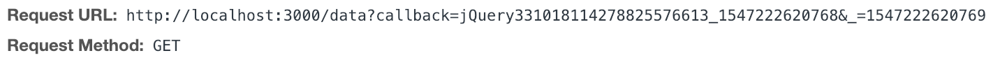

# JSONP Demo

This demo is to show you how to use JSONP to resolve the cross-origin requests. Rememeber JSONP approach requires **both** frontend and backend support.

> JSONP is a method for sending JSON data without worrying about cross-domain issues.
>
> JSONP does not use the `XMLHttpRequest` object.
>
> JSONP uses the `<script>` tag instead.

Frontend: jQuery

```shell
cd client
npm install & npm start
```

Backend: nodejs+express

```shell
cd server
npm install & npm start
```


## Frontend

A simple index.html which is hosted on webpack dev server at http://localhost:4000.

When pages loads, a get request with dataType: 'jsonp' is sent to server.



jQuery will create a callback function(*jQuery331018114278825576613_1547222620768*) and automatically patches the request URL to contain this function which will be used by nodejs to include in the response.

```javascript
// response from nodejs
/**/ typeof jQuery331018114278825576613_1547222620768 === 'function' && jQuery331018114278825576613_1547222620768([{"name":"A"},{"name":"B"},{"name":"C"}]);
```

This response will be wrapped in a script tag which is not restricted by browser's SOP(single origin policy).

```http
// response header
Content-Type: text/javascript; charset=utf-8
```

jQuery will call this function to extract the data and pass to your promise's success callback function. Thus you will be able to use the data.

## Backend

Backend is pretty simple. The only thing is to send response using .jsonp() instead of .json().

```javascript
res.jsonp(data);
```

.jsonp() method will wrap the data in the supplied callback function as shown above.